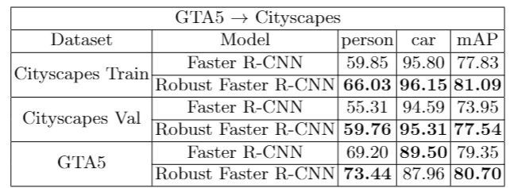

# Robust Domain Adaptive Faster R-CNN for Object Detection
This is a Keras/TF implementation of the 2019 ICCV paper "A Robust Learning Approach to Domain Adaptive Object Detection" (https://arxiv.org/abs/1904.02361) that includes some additional features which I found were beneficial to increase domain adaptive performance. 

The base code used for the Faster R-CNN implementation is heavily based on the code found in https://github.com/kentaroy47/frcnn-from-scratch-with-keras.

Domain adaptation in object detection consists of using two datasets: a labelled one with images and their bounding boxes, and an unlabelled one consisting only of images, usually coming from a different distribution than the first one.
The former is called the Source (S) domain and the latter the Target (T) domain. As stated in the paper, domain adaptation is achieved by splitting the training into three phases:
1) Train an original Faster R-CNN implementation only on the source domain, and after training running inference on the target domain to get the detected objects in these images 
2) Train an auxiliary image classifier using the known bounding boxes of the source domain and the detections obtained by running the phase 1 F-RCNN on the target domain
3) Train the final robust Faster R-CNN on both data domains by using the phase 1 and phase 2 networks to obtain good estimates of the bounding boxes and labels for the target domain 

## Additional Features

Additional to the methods described in the original paper, there are some additional modelling features available to achieve domain adaptation:
1) Flexibility in choosing to use hard-thresholding of easy target samples, similar to the work done in https://arxiv.org/abs/1904.07305.
2) Flexibility in chossing the semi-supervised training method to train the phase 2 classifier. One can choose from the original implementation
inspired on https://arxiv.org/abs/1706.00038 or an entropy-minimization approach as the one in https://papers.nips.cc/paper/2740-semi-supervised-learning-by-entropy-minimization.pdf.
3) The ability to choose the way the hyperparmeter alpha is computed. One can use the original paper's schedulling of alpha or a data-driven approach using the Jensen-Shannon Distance and a relaxation similar to the one taken in https://arxiv.org/abs/1905.12775.

Using these added feature I was able to obtain the following performance on two different domain adaptation tasks:
* Cityscapes to KITTI focusing solely on the person/Pedestrian classes
* GTA5 to Cityscapes on the person and car classes




## Pre-processing and data format

The repository is designed to handle the different images and their bounding boxes information from `.txt` files that have the corresponding image, their bounding box coordinates, the corresponding class and the set type (train/test) as follows:
```
...
img_path, x1, y1, x2, y2, class_name, set_type
...
```
To ease the pre-processing there are three scripts for generating such files for the `Cityscapes`, `KITTI` and `GTA5` datasets in the `file_makes` directory. These scripts peform two types of pre-preocessing, according to the implementation in the cited paper.

When using a dataset as the source domain then we simply create a file with all the chosen classes to be used as `train` classes.
Using the scripts with `--domain_type` set to `target` will create a single file with two set tags: `train` and `test`. The `test` images will only be used at the end in order to avoid biasing the model selection. 

Note however that usually the class names for source and target datasets **do not** match, and in order to avoid issues during training/testing you have to **manually** change the `SOURCE_TARGET_DICT` inside the `file_makers` files in order to align the target class names with the source class names. A working example is included in the files.

## Requirements and versions
Before starting, please note that the code was tested using `Tensorflow 1.12.0` and `Keras 2.24`. Additional requirements can be installed by running
```
pip install -r requirements.txt
```

## Training a Domain Adaptive Faster R-CNN

There are two ways of running the full training algorithm: 
* You can modify the input variables and execute the `run_all_steps.sh` script, which executes all the necessary steps to produce the final Robust Faster R-CNN
* Or you can execute each of the individual steps one at a time. This approach is recommended as it is best in order to ensure each training stage goes well. Below are the details for each individual stage

### Phase 1: Faster R-CNN

As stated in kentaroy47's repository, before training the Faster R-CNN one can optionally train first the RPN component separately with the `train_phase1_rpn.py` script.
This is in case you want to be extra cautious in making sure the training goes smoothly, but can also be skipped to perform the full Faster R-CNN training in one go.

To train the original Faster R-CNN implementation you can simply update the parameters inside the `phase1_fine_tuning.sh` script and then execute it. This file is located in the `shell_scripts` directory. 

Since training a Faster R-CNN from scratch can be time consuming you can also perform fine tuning by downloading the following weights 

https://drive.google.com/file/d/1jCLuydSnQ-mNHWrV1rwibfab0ao2VE29/view?usp=sharing

These weights correspond to using `vgg16` as backbone network and training on all the classes of the `Pascal VOC 2012` set. 

The fine tuning can be done by using the `phase1_fine_tuning.sh` script, after updating its input parameters.

### Phase 2: Auxiliary Image Classifier

Before modifying and running the `phase2_training.sh` script first you must execute the `test_frcnn.sh` script on the train set of the target domain.
This will allow to obtain the pseudo-labels for the semi-supervised training of the phase 2 classifier.

You can choose the semi-supervised method to train this classifier by using the `--model_type` parameter of the training script. 
Using a value of 1 uses the original paper's implementation, while 2 uses an entropy-minimization approach.

It is also possible to use easy hard-thresholding and empirical alpha updates by including the `--hard_constraints` and the `--recompute_alpha` flags, respectively.

Once this stage of the training is finished you can verify the performance of the classifier by using the `test_phase2_classifier.sh` script.

### Phase 3: Robust Faster R-CNN

Finally, to obtain the final Robust Faster R-CNN you can modify and execute the `phase3_training.sh` script using the elements from previous stages.

It is also possible to use easy hard-thresholding and empirical alpha updates by including the `--hard_constraints` and the `--recompute_alpha` flags, respectively.

## Testing the final object detector

As a closing note, as shown in the previously stated results, it could also be of interest to measure the change in performance (mAP) of the initial detector from phase 1 versus
the final detector from phase 3. In order to do so you only need to modify the weights path from the `test_frcnn.sh` script (assuming you are using the same backbone network on both stages).

It is also possible to save the images with their corresponding detections by including the `--save_imgs` flag when executing this script.
 